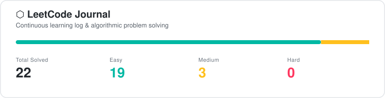

<div align="center">

[](https://github.com/CelestialWorthyOfHeavenAndEarth/leetcode-journal)



[](https://github.com/CelestialWorthyOfHeavenAndEarth/leetcode-journal)
[](https://github.com/CelestialWorthyOfHeavenAndEarth/leetcode-journal)
[](https://console.groq.com)

</div>

---

```
  LeetCode Journal — Auto-generated technical notes for every problem solved.
  Topic-organised, AI-analysed, committed to GitHub on every submission.
```

---

## Progress

| Topic | Easy | Medium | Hard | Total |
|:------|:----:|:------:|:----:|:-----:|
| Arrays | 4 | 0 | 0 | 4 |
| Dynamic Programming | 0 | 0 | 0 | 0 |
| Graphs | 0 | 0 | 0 | 0 |
| Trees | 0 | 0 | 0 | 0 |
| Linked Lists | 0 | 0 | 0 | 0 |
| Sliding Window | 0 | 0 | 0 | 0 |
| Binary Search | 0 | 0 | 0 | 0 |
| Two Pointers | 0 | 0 | 0 | 0 |
| Stack | 0 | 0 | 0 | 0 |
| Heap | 0 | 0 | 0 | 0 |
| Backtracking | 0 | 0 | 0 | 0 |
| Math | 0 | 0 | 0 | 0 |
| String | 1 | 0 | 0 | 1 |
| Greedy | 0 | 0 | 0 | 0 |
| Bit Manipulation | 0 | 0 | 0 | 0 |

---

## Setup

```bash
# 1. Create a GitHub repository
git init && gh repo create leetcode-journal --public

# 2. Get your Groq API key
open https://console.groq.com   # free tier, fast inference

# 3. Get a GitHub Personal Access Token
open https://github.com/settings/tokens  # scope: repo

# 4. Load the extension
# chrome://extensions -> Developer Mode -> Load Unpacked
```

---

<div align="center">

[](https://github.com/CelestialWorthyOfHeavenAndEarth/leetcode-journal)

</div>
